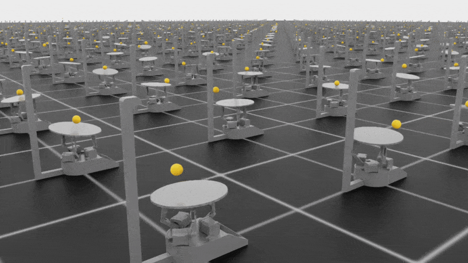
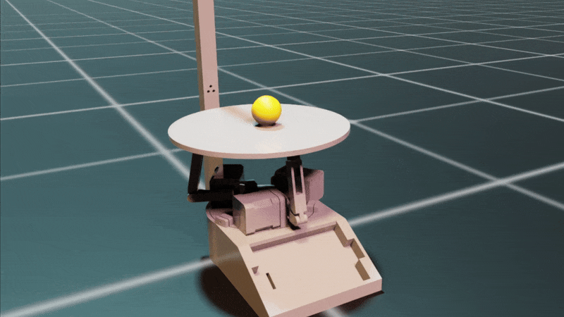
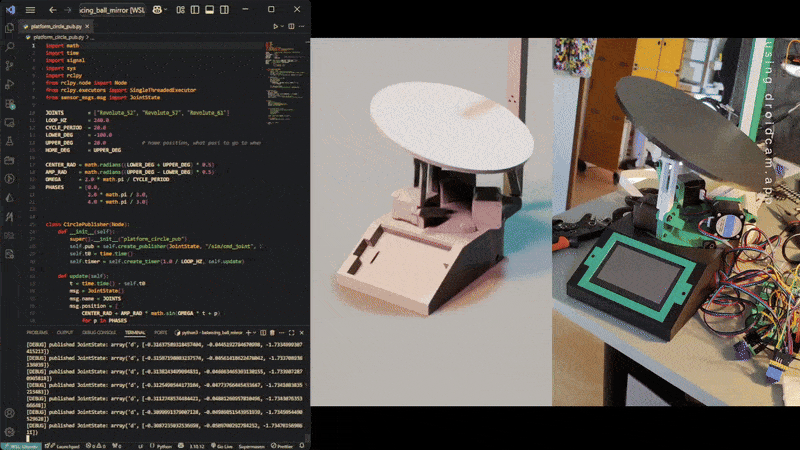
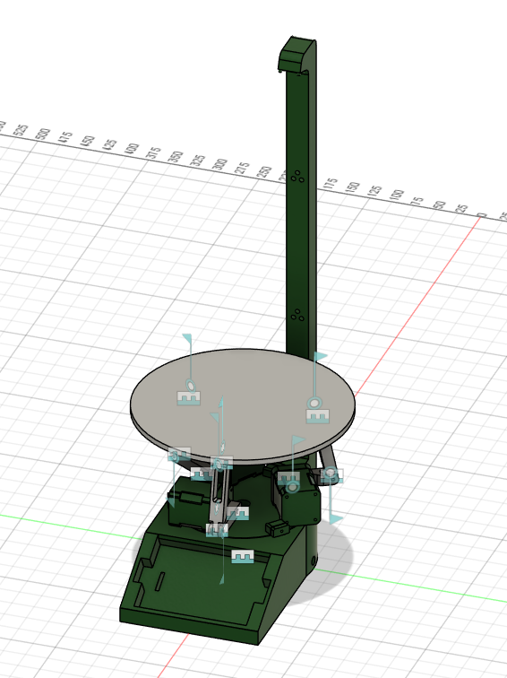
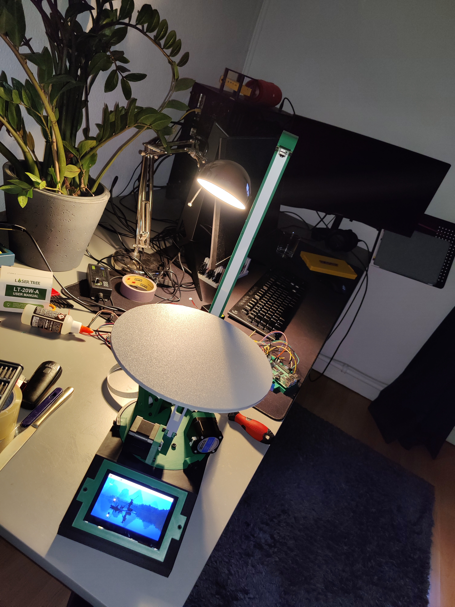

# Ball Balancer

A **sim2real** reinforcement learning project for **balancing a ball on a 3-DOF tilting platform**. The agent learns entirely from camera images in simulation (NVIDIA Isaac Lab) and transfers to a physical robot powered by a Raspberry Pi with stepper motors.

> ⚠️ **Work Halted** — This project is paused until my thesis is finished. The robot balances the ball in simulation but not yet on real hardware!

<p align="center">
  
  &nbsp;&nbsp;
  
  <br>
  <em>Left: Start of training (512 parallel envs) &nbsp;|&nbsp; Right: Trained agent balancing</em>
</p>

---

## Overview

This monorepo contains everything needed to train a vision based RL policy in simulation and deploy it on real hardware:

| Component | Description |
|-----------|-------------|
| **`sim/`** | Isaac Lab environment for training PPO policies with stacked RGB frames |
| **`real/`** | C++ inference pipeline for Raspberry Pi (camera capture, ONNX runtime, stepper control) |
| **`assets/`** | CAD models (Fusion 360, USD) of the ball balancer platform |

### Architecture

```
                    SIMULATION (sim/)
  ┌─────────────┐    ┌─────────────┐    ┌─────────────┐
  │  Isaac Lab  │───>│  PPO Agent  │───>│ Export ONNX │
  │ Environment │    │   (skrl)    │    │   Policy    │
  └─────────────┘    └─────────────┘    └──────┬──────┘
                                               │
                                               v
                    REAL HARDWARE (real/)
  ┌─────────────┐    ┌─────────────┐    ┌─────────────┐
  │   Camera    │───>│ ONNX Runtime│───>│   Stepper   │
  │ Frame Stack │    │  Inference  │    │  Controller │
  └─────────────┘    └─────────────┘    └─────────────┘
```

---

## Simulation (`sim/`)

The simulation environment is built on [NVIDIA Isaac Lab](https://isaac-sim.github.io/IsaacLab/) and uses the [skrl](https://skrl.readthedocs.io/) library for RL training.

<p align="center">
  
  <br>
  <em>Digital twin setup: Simulation and real robot rotating the platform</em>
</p>

### Features

- **Vision-based control**: Agent observes 4 stacked RGB frames (64×64) — no privileged state information
- **Domain randomization**: Random ball spawn positions, velocity perturbations during episodes
- **Reward shaping**: Position + velocity costs, center bonus, drop penalty, and dynamic joint penalties for stability

### Installation

1. Install Isaac Lab following the [official guide](https://isaac-sim.github.io/IsaacLab/main/source/setup/installation/index.html)

2. Install the ball balancer extension:
   ```bash
   cd sim
   python -m pip install -e source/ball_balancer
   ```

3. Verify installation:
   ```bash
   python scripts/list_envs.py
   # Should show: Template-Ball-Balancer-Direct-v0
   ```

### Training

```bash
# Train with PPO (headless, 512 parallel environments)
python scripts/skrl/train.py \
    --task=Template-Ball-Balancer-Direct-v0 \
    --ml_framework=torch \
    --algorithm=PPO \
    --num_envs=512 \
    --device=cuda:0 \
    --headless \
    --enable_camera
```

### Evaluation

```bash
# Run trained policy
python scripts/skrl/play.py \
    --task=Template-Ball-Balancer-Direct-v0 \
    --enable_camera

# Test with random actions
python scripts/random_agent.py --task Template-Ball-Balancer-Direct-v0 --enable_camera

# Test with zero actions
python scripts/zero_agent.py --task Template-Ball-Balancer-Direct-v0 --enable_camera
```

---

## Real Hardware (`real/`)

<p align="center">
  
  &nbsp;&nbsp;
  
  <br>
  <em>Left: CAD model in Fusion 360 &nbsp;|&nbsp; Right: Assembled hardware</em>
  <br>
  <em>(Display was removed in newer version)</em>
</p>

The real world deployment runs on a Raspberry Pi with:
- **Camera**: libcamera-based capture with frame stacking
- **Inference**: ONNX Runtime for neural network inference
- **Actuators**: 3× [NEMA 17 stepper motors](https://www.amazon.de/dp/B0B38GHRH8) driven by TMC2209 drivers via GPIO (libgpiod)
- **Frame**: 3D printed platform (Fusion 360 source files in `assets/`)

### Prerequisites

- Raspberry Pi 4/5 with camera module
- ONNX Runtime for ARM64:
  ```bash
  wget https://github.com/microsoft/onnxruntime/releases/download/v1.20.1/onnxruntime-linux-aarch64-1.20.1.tgz
  tar -xvzf onnxruntime-linux-aarch64-1.20.1.tgz
  ```

- Dependencies:
  ```bash
  sudo apt install libopencv-dev libgpiod-dev libcamera-dev
  ```

### Build

```bash
cd real
mkdir build && cd build
cmake ..
make -j4
```

### Run

```bash
# Main inference loop
./build/ball_balancer

# Manual stepper control (for testing)
g++ stepper_driver/cli_control.cpp -o cli_control -lgpiod -lpthread && ./cli_control

# Random agent (for testing)
g++ stepper_driver/rand_agent.cpp -o random_agent -lgpiod -lpthread && ./random_agent
```

---

## Project Structure

```
ball_balancer_mono/
├── assets/                          # CAD models
│   ├── ball_balancer.f3d            # Fusion 360 source
│   ├── ball_balancer_urdf_rdy.f3d   # URDF-ready version
│   └── ball_balancer.usd            # USD for Isaac Sim
│
├── sim/                             # Simulation & training
│   ├── source/ball_balancer/        # Isaac Lab extension
│   │   └── ball_balancer/
│   │       └── tasks/direct/ball_balancer/
│   │           ├── ball_balancer_env.py      # Environment
│   │           ├── ball_balancer_env_cfg.py  # Configuration
│   │           └── agents/skrl_ppo_cfg.yaml  # PPO hyperparameters
│   ├── scripts/
│   │   ├── skrl/train.py            # Training script
│   │   ├── skrl/play.py             # Evaluation script
│   │   ├── random_agent.py          # Random baseline
│   │   └── zero_agent.py            # Zero-action baseline
│   └── logs/                        # TensorBoard logs & checkpoints
│
├── real/                            # Hardware deployment
│   ├── main.cpp                     # Main inference loop
│   ├── camera/
│   │   ├── camera_wrapper.hpp       # libcamera interface
│   │   └── frame_stack.hpp          # Frame stacking logic
│   ├── stepper_driver/
│   │   ├── stepper_controller.hpp   # GPIO stepper control
│   │   └── cli_control.cpp          # Manual control utility
│   └── models/                      # Exported ONNX policies
│       └── version_2/policy2.onnx
│
└── README.md
```

---

## Roadmap

- [x] Isaac Lab environment with frame stacking
- [x] PPO training pipeline (skrl)
- [x] Stepper motor controller
- [x] Camera frame stack pipeline
- [x] ONNX inference on Raspberry Pi
- [ ] Full sim2real transfer validation
- [ ] Test with encoder so agent has position information
- [ ] Model quantization for Hailo NPU
- [ ] Hailo NPU acceleration
- [ ] Automatic policy export from training

---

## References

- [NVIDIA Isaac Lab](https://isaac-sim.github.io/IsaacLab/)
- [skrl - Reinforcement Learning Library](https://skrl.readthedocs.io/)
- [ONNX Runtime](https://onnxruntime.ai/)
- [Raspberry Pi 5](https://www.raspberrypi.com/products/raspberry-pi-5/)
- [Hailo AI HAT+](https://www.raspberrypi.com/products/ai-hat/)

---

