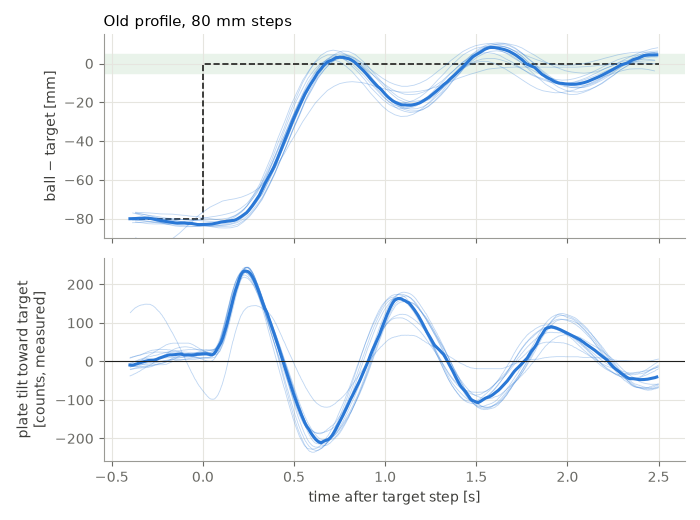
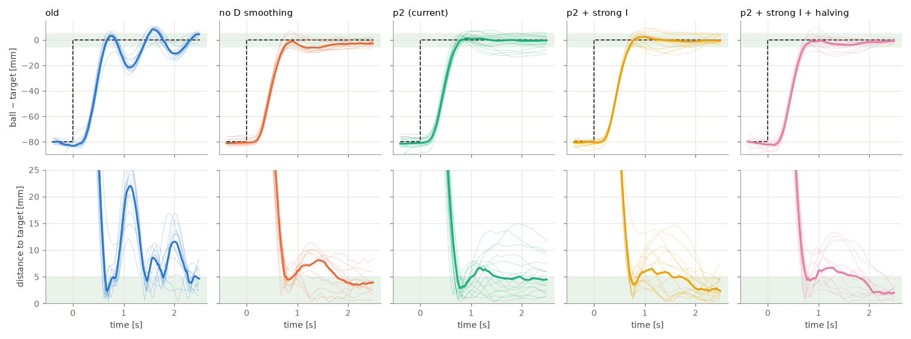
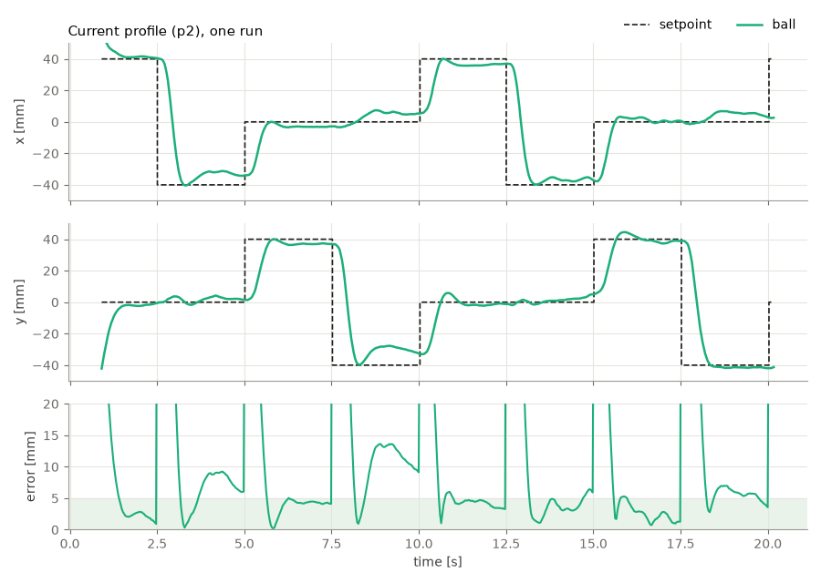
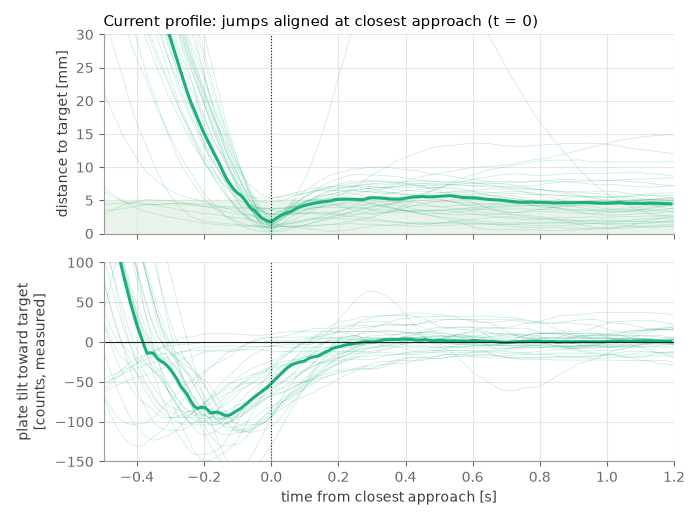
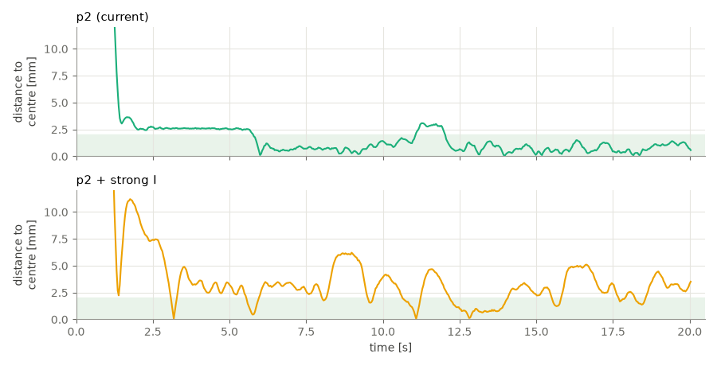
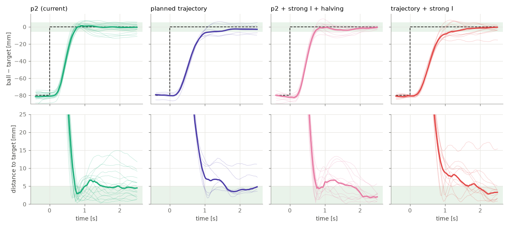

# PID optimisation, 2026-09-11

Measurements on the live rig (profile `my-platform`, guardrail fitted, 40 mm
table-tennis ball) to find out why the ball overshoots and what limits the
controller. The result is the current `[balance]` profile ("p2") and a list of
what else was tried. Background on dead time and limits is in
[balance.md](balance.md).

## How it was measured

[`tools/balance/servo_trace.py`](../tools/balance/servo_trace.py) runs the
normal `balance` loop. A second thread reads every servo's position, speed,
load and supply voltage over the bus at about 350 Hz. Camera frames, goal
writes and servo samples share one clock, so ball, command and real leg motion
can be compared directly.

Two tests:

- **steps**: the target jumps every 2.5 s between (±40, 0) and (0, ±40) mm.
  12 jumps per run, 80 mm and 57 mm long.
- **hold**: target at the centre for 20 s, ball released at the rim.

Metrics:

| Metric | Definition |
| --- | --- |
| 90 % | time until the ball has covered 90 % of the jump |
| overshoot | furthest the ball gets past the target, along the jump |
| within 5 mm | jumps where the ball stays within 5 mm until the next jump, and the median time from which it does |
| end error | median distance to the target over the last 0.6 s before the next jump |
| hold mean / p95 | distance to the centre from 5 s on |
| leg / frame | mean change of a leg goal per camera frame, in counts (plate jitter) |

Gains below are given in leg counts: kp in counts/mm, ki in counts/(mm·s), kd
in counts/(mm/s). The profile stores them as tilt fractions; multiply by the
reach of 250 counts.

## What was wrong with the old profile

The ball reached the target after 0.6 s, fell back about 20 mm and swung on at
about 1.1 Hz. Most of what looked like overshoot was this ringing. The plate
tilt (bottom) shows why: the braking tilt peaks at 0.65 s, when the ball has
already stopped, and pushes it back.

The loop was close to its stability limit. In a simulation of the rig, 10 ms
more latency raised the overshoot from 7 to 14-17 mm.

## Where the time goes

| Stage | Delay |
| --- | ---: |
| goal written → legs at the goal | 84-102 ms (per axis) |
| legs move → ball motion in the camera frame | 22 ms |
| **command → ball** | **106 ms** |

The servos account for about 90 of the 106 ms. They are limited by the
firmware: about 30 ms before they start, an acceleration cap of about
25 000 counts/s², and a top speed of 1700-2000 counts/s under load. The goal
speed of 3400 counts/s is never reached. The 5.4 V supply drops to 4.4 V during
jumps, below `min_voltage = 4.5`.

Two further effects:

- **Tilting moves the ball in the image.** The ball's centre is above the
  plate, so tilting carries it sideways at once, about 6 mm per unit of tilt.
  The derivative sees this as ball velocity and reacts to it.
- **The plate needs about 20 counts of x tilt to hold the ball at the centre.**
  The home pose is not level there, or the plate is uneven.

## Settings tested

| Setting | kp | ki | kd | D smoothing | predict | plant_gain |
| --- | ---: | ---: | ---: | ---: | ---: | ---: |
| old | 3.9 | 2.0 | 1.4 | 0.45 | 85 ms | 4.1 |
| no D smoothing | 4.2 | 2.0 | 1.3 | 0.93 | 128 ms | 5.33 |
| **p2 (current)** | **4.1** | **2.0** | **1.0** | **0.29** | **173 ms** | **5.94** |
| p2 + strong I | 4.1 | 6.0 on measured error | 1.0 | 0.29 | 173 ms | 5.94 |
| p2 + strong I + halving | as above, integral halved when the ball crosses the target | | | | | |

Top row: ball position relative to the target along the jump; dashed is the
setpoint. Bottom row: distance to the target. Thin lines are single jumps, thick
is the median, green is ±5 mm.

| Setting | jumps | 90 % | overshoot | within 5 mm | end error | hold mean / p95 | leg / frame |
| --- | ---: | ---: | ---: | ---: | ---: | ---: | ---: |
| old | 24 | 0.59 s | 7.2 mm | 18/24, 1.94 s | 4.5 mm | 1.9 / 3.6 mm | 1.4 |
| no D smoothing | 24 | 0.73 s | 0.0 mm | 20/24, 1.37 s | 4.2 mm | 2.2 / 3.7 mm | 12.3 |
| **p2 (current)** | 36 | 0.67 s | 2.9 mm | 25/36, 1.30 s | 4.4 mm | 1.5 / 3.1 mm | 1.2 |
| p2 + strong I | 36 | 0.68 s | 2.5 mm | 33/36, 1.55 s | 2.5 mm | 2.2 / 6.1 mm | 1.4 |
| p2 + strong I + halving | 24 | 0.67 s | 2.7 mm | 22/24, 1.39 s | 2.4 mm | 2.6 / 4.7 mm | 2.0 |

The table covers all jumps; the plots show only the 80 mm ones. Hold values are
the mean of 1-3 runs, and single hold runs scatter a lot.

**No D smoothing** removed the overshoot completely. While holding, the plate
buzzed at 5.5 Hz (12 counts per frame, commands on 94 % of frames). This is the
image shift from tilting: the derivative answers its own plate motion. Rejected.

**p2** was found in the simulation, optimised against four cases (nominal,
+10 ms latency, plant gain ±10 %) with plate jitter limited to the old level.
The longer prediction brakes earlier; the stronger D smoothing keeps the noise
that the longer prediction amplifies away from the plate. `predict_ms` and
`plant_gain` are therefore tuning values, not the measured dead time and gain.

## The current profile

The ball follows each step in about 0.7 s with little overshoot. After that it
often stops a few millimetres beside the target and stays there, for example
x between 2.5 and 5 s: target −40 mm, ball at −33 mm.

## Why the ball ends up beside the target

All 36 jumps, aligned at the moment the ball is closest to the target.

- In 81 % of the jumps the ball comes within 3 mm of the target (median
  1.7 mm).
- At that moment the plate still tilts 52 counts away from the target
  (bottom). The braking comes too late because of the servo delay. The ball is
  stopped at the target and pushed off again.
- Then it sticks. From rest the ball needs 10-25 counts of tilt before it
  rolls. The controller gives less, for two reasons:
  - The predictor assumes the tilts already sent will move the ball. While the
    ball sticks it predicts 10-16 mm/s towards the target, against 0.3 mm/s
    measured. The derivative then removes 8-17 counts of tilt.
  - The integral works on the predicted error, which the same assumption
    makes too small.
- Where the ball stops is repeatable per target position. This points to an
  uneven plate rather than random friction.

## Stronger integral: better jumps, worse holding

Letting the integral work on the measured error and making it three times
stronger pushes the ball off these spots. The end error drops from 4.4 to
2.5 mm, and 33 of 36 jumps end within 5 mm.

While holding at the centre, the same integral makes the ball hunt. It sticks,
the integral grows until the ball breaks loose, the ball slides too far and
sticks on the other side. The result is a slow oscillation of 0.2-0.35 Hz with
±2-2.5 mm, against ±0.7-0.9 mm with p2. Halving the integral when the ball
crosses the target reduced this but did not remove it.

## Planned trajectory

Instead of a step, the target moves along a smooth path (minimum jerk, 1.0 s
for 80 mm). The tilt the path needs is sent 160 ms early to cover the servo
delay; the controller only corrects deviations.

| Setting | jumps | 90 % | overshoot | within 5 mm | end error |
| --- | ---: | ---: | ---: | ---: | ---: |
| p2 (current) | 36 | 0.67 s | 2.9 mm | 25/36 | 4.4 mm |
| planned trajectory | 12 | 0.90 s | 0 mm | 8/12 | 4.1 mm |
| p2 + strong I + halving | 24 | 0.67 s | 2.7 mm | 22/24 | 2.4 mm |
| trajectory + strong I | 24 | 0.86 s | 2.0 mm | 22/24 | 2.5 mm |

The trajectory removes the overshoot. The ball then approaches slowly, stops
short of the target and sticks. The end error only improves with the stronger
integral, and the trajectory adds nothing to that but 0.2 s of rise time.

## Other things tried

| Setting | Result |
| --- | --- |
| tilt cap 75 % instead of 62.5 % (same gains in counts) | 90 % after 0.63 s instead of 0.67 s; end error 5.1 mm, only 12/24 within 5 mm |
| integral only while the ball is slower than 15 mm/s | end error 3.3 mm, hold 1.7 / 3.7 mm; between p2 and strong I |
| integral only while the ball is slower than 8 mm/s | worse than p2; the integral is blocked too often |
| Kalman estimator with a disturbance state, plus image-shift correction | end error 2.4 mm, but 90 % after 0.80 s, 5 mm overshoot, and a 2.2 Hz oscillation while holding (8.7 counts per frame) |

All variants except p2 were run with temporary patches to the loop. They are
not part of the code.

## Conclusions

1. p2 is in the profile. Against the old profile: overshoot 7.2 → 2.9 mm, the
   ringing is gone, same plate jitter while holding. The end error is unchanged
   at about 4.4 mm.
2. The remaining error comes from the ball sticking in the last millimetres,
   not from the controller overshooting. A stronger integral fixes it for
   target changes and causes hunting while holding. Controller settings alone
   only trade one against the other.
3. The servos are about 90 of 106 ms of dead time. Faster servos or a faster
   camera help only a little in the simulation; the firmware delay and the
   acceleration cap remain.
